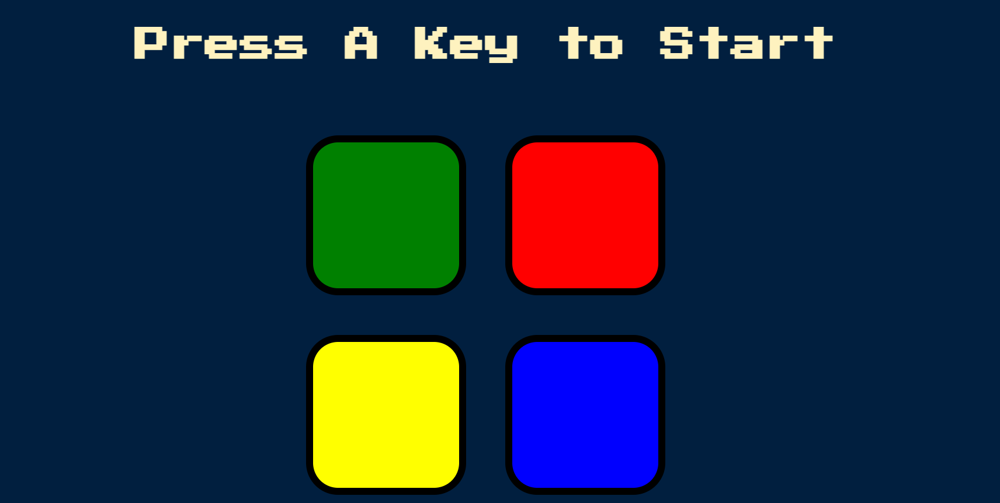

# Simon Game
## Notes
This project was created as an exercise whilst learning JavaScript from Udemy's course *'The Complete Full-Stack Web Development Bootcamp'* by Dr. Angela Yu.

The HTML and CSS were already created by Dr. Angela Yu, however the entire JavaScript is my own.

## How To Play
1. Start the game by pressing any key on your keyboard.
2. The game will select and then show you which button is first in the sequence. ( example : RED )
3. You then input the sequence yourself. ( input : RED )
4. On the next turn, the game will only show you the latest addition to the sequence ( example : YELLOW ). It is up to you to have memorised everything that came before ( example : RED, YELLOW ).
5. You then input the whole sequence again ( input : RED, YELLOW ). 
    - **If you make a mistake whilst redoing the sequence** : It is Game Over. You can restart the game by pressing any key on your keyboard.
    - **If you redo the entire sequence correctly**, the game continues as explained in steps 4 and 5.

## Game Image
